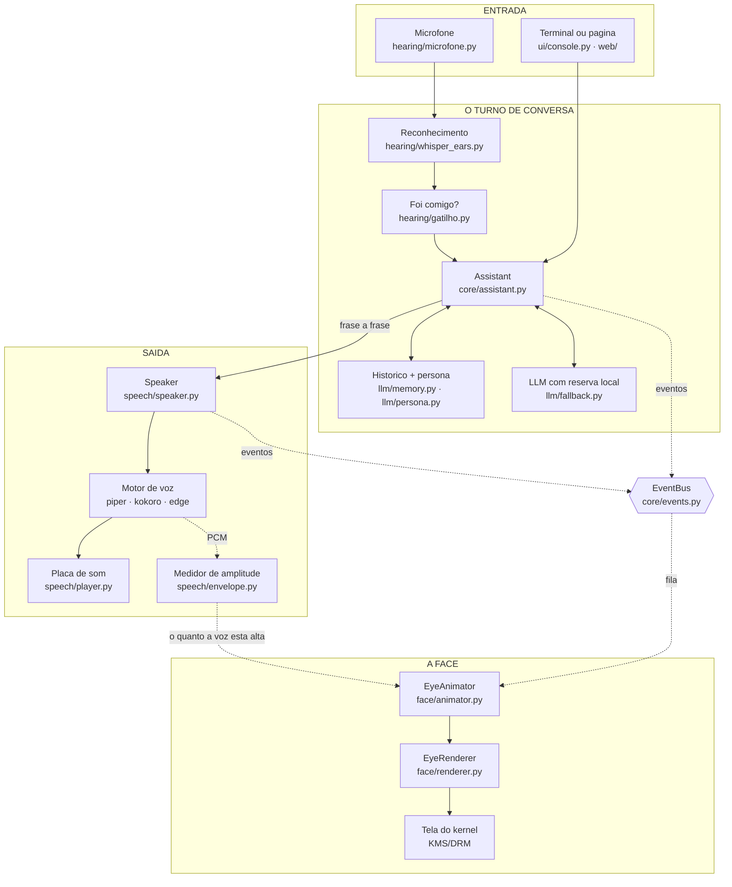
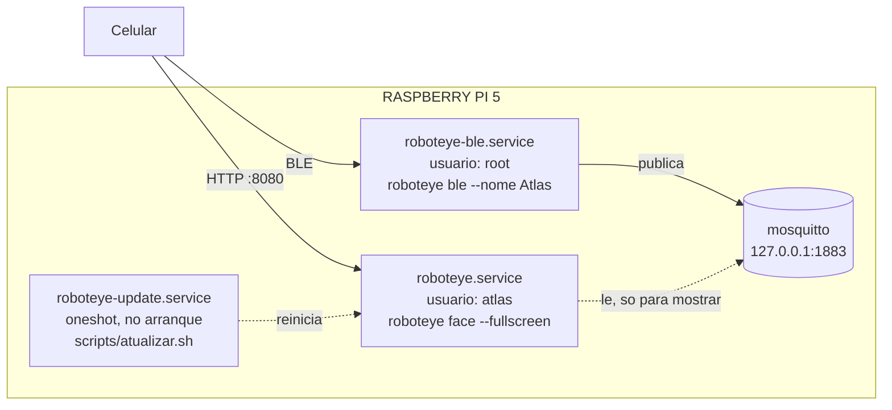
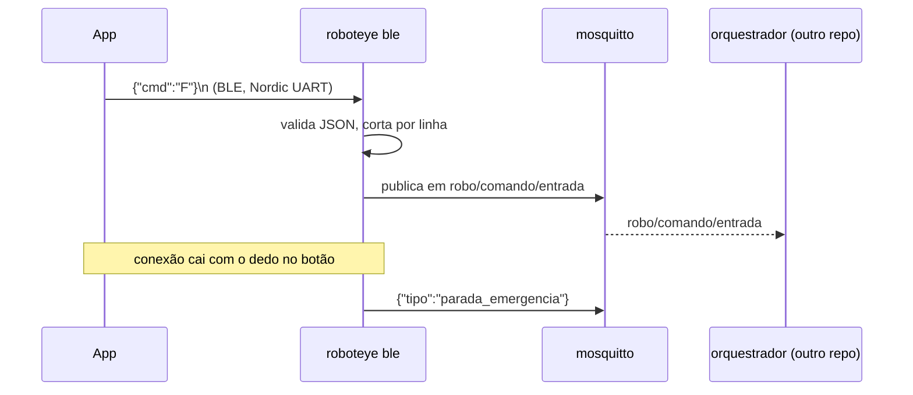

# Como funciona o `atlas_ai_v2`

> **Para quem nunca viu este projeto.** Este documento é um passeio guiado pelo
> código: o que cada peça faz, por onde a informação passa, e por que o desenho
> é esse. Leva uns quinze minutos e não exige conhecer o robô.
>
> - Quer **instalar**? → [`README.md`](./README.md)
> - Quer saber como este repositório conversa com os **outros dois**?
>   → [`../orquestrador/MAPA-COMUNICACAO.md`](../orquestrador/MAPA-COMUNICACAO.md)
> - Vai **mexer no código**? Leia isto e depois [`CLAUDE.md`](./CLAUDE.md).

---

## 1. Em uma frase

Este repositório é **a cara da Atlas**: uma face animada que fica numa tela,
escuta pelo microfone, pergunta a um modelo de linguagem, e responde falando —
tudo rodando num Raspberry Pi 5.

Ele **não** move o robô. Motores, GPS e Wi-Fi são do repositório
[`orquestrador`](../orquestrador). O único ponto de contato entre os dois é a
ponte Bluetooth, e ela está explicada na [§7](#7-a-ponte-bluetooth-o-único-fio-que-sai-daqui).

---

## 2. O mapa



**A leitura mais curta do diagrama:** ninguém no meio conhece as pontas. O
microfone não sabe o que é um modelo de linguagem; a face não sabe o que é uma
placa de som. As peças se falam por **eventos** e por **interfaces**, e é isso
que permite rodar o robô sem tela, sem microfone, ou sem internet — cada uma
some sem levar as outras junto.

---

## 3. O caminho de uma pergunta, passo a passo

Alguém diz *“Atlas, quantos alunos tem a Setrem?”*. Isto é o que acontece:

| # | Onde | O que acontece |
|---|---|---|
| 1 | `hearing/microfone.py` | A placa entrega blocos de 30 ms. Um passa-alta tira o zumbido, e a energia de cada bloco é comparada com um limiar **medido na sala no arranque**. O som subiu → começa a gravar; ficou quieto o bastante → fecha a frase. |
| 2 | `hearing/whisper_ears.py` | O trecho fechado vai para o `faster-whisper`, que devolve texto, quanto demorou e o quanto confiou. |
| 3 | `hearing/gatilho.py` | O texto começa com o nome dela? Então a pergunta é o resto. Dizer só *“Atlas!”* abre uma **janela de 8 segundos** em que a frase seguinte é aceita sem o nome — que é como as pessoas realmente falam. |
| 4 | `app.py::_escutar` | Publica `SpeechHeard` no barramento (para a tela de depuração ver até o que foi ignorado) e entrega a pergunta ao `Assistant`. |
| 5 | `core/assistant.py` | **Interrompe a fala em curso** — quem fala por último é a pessoa —, guarda a pergunta no histórico e publica `ThinkingStarted`. A face muda de expressão. |
| 6 | `llm/fallback.py` | Pergunta ao modelo da rede. Se ele sumiu, cai para o modelo local do próprio Pi, **sem esperar o tempo limite estourar** (ver [§5](#5-as-quatro-decisões-que-explicam-o-desenho)). |
| 7 | `core/text.py::stream_sentences` | A resposta chega token a token. Assim que uma **frase fecha**, ela já é entregue à voz — a Atlas começa a falar enquanto o modelo ainda escreve o resto. |
| 8 | `speech/speaker.py` | Sintetiza e toca. Enquanto uma frase toca, **a próxima já está sendo sintetizada** numa thread paralela. |
| 9 | `speech/envelope.py` | O mesmo PCM que vai para o alto-falante passa por um medidor de amplitude, um valor a cada 20 ms. |
| 10 | `face/animator.py` | A face lê esse valor e move os olhos **junto com a voz de verdade**, e não com uma oscilação inventada. |

Uma pergunta digitada (no terminal ou na página do celular) entra direto no
passo 5. É o mesmo caminho daí em diante.

---

## 4. As peças, uma a uma

### `app.py` — a raiz de composição

O único arquivo que sabe como as peças se encaixam. `Application.build()`
constrói tudo e injeta as dependências; nenhum subsistema constrói outro. É por
isso que dá para trocar o motor de voz, o modelo de linguagem ou o
reconhecimento sem tocar em mais nada.

Também é quem decide os **modos de execução**:

| Modo | Comando | O que roda |
|---|---|---|
| `run_interactive` | `roboteye run` | Face na thread principal + chat de texto ao fundo |
| `run_face` | `roboteye face` | Só a face (é o que o robô instalado usa) |
| `run_chat` | `roboteye chat` | Só o terminal, sem pygame |

### `core/` — o coração

- **`events.py`** — o barramento. Dez tipos de evento (`UserMessage`,
  `ThinkingStarted`, `AssistantReply`, `SpeechStarted`, `SpeechFinished`,
  `SpeechHeard`, `ListeningChanged`, `ErrorOccurred`, `Notice`, `Shutdown`),
  todos `frozen`. Um assinante que quebra é registrado no log e ignorado: um
  subsistema com defeito não derruba os outros.
- **`assistant.py`** — o turno de conversa, numa thread própria para a interface
  nunca travar esperando o modelo. Também é onde moram `teach()` / `forget()`,
  que deixam a Atlas aprender fatos em tempo de execução.
- **`text.py`** — o corte em frases (`stream_sentences`), que é o que permite
  falar antes de o modelo terminar.
- **`normalize_pt.py` / `numbers_pt.py`** — preparam o texto para a voz: “1.500”
  vira “mil e quinhentos”, “Dr.” vira “doutor”. Sem isso a Atlas leria os
  símbolos.

### `hearing/` — os ouvidos

`Ouvido` é a interface; há duas implementações (`whisper_ears.py`,
`vosk_ears.py`) e uma fábrica (`factory.py`). O trabalho difícil está em
**`microfone.py`**, que decide *onde uma frase começa e termina* — o Whisper não
tem opinião sobre isso.

Três detalhes desse arquivo decidem se a escuta funciona ou irrita:

1. **O silêncio precisa caber uma vírgula.** Cortar em 400 ms transforma
   “Atlas, quantos alunos tem?” em duas frases pela metade.
2. **O começo da fala não pode ser perdido.** Quando o som cruza o limiar, a
   primeira sílaba já passou — então 300 ms do que veio antes vão junto.
3. **O limiar não pode ser um número fixo.** Cada sala tem um ruído; ele é
   medido no arranque.

### `llm/` — a inteligência

- **`base.py`** — `LLMClient`, um `typing.Protocol`.
- **`ollama.py`** — o cliente HTTP de verdade.
- **`fallback.py`** — embrulha dois clientes (rede + local) atrás da mesma
  interface. **Este é o arquivo que faz o robô continuar conversando quando o
  Wi-Fi cai no meio de uma apresentação.**
- **`memory.py`** — o histórico, limitado às últimas N mensagens.
- **`persona.py`** — quem ela é (`persona/atlas.md`) e o que aprendeu
  (`persona/atlas.memoria.md`).

### `speech/` — a voz

- **`base.py`** — `TTSEngine`, outro `Protocol`.
- **`factory.py`** — escolhe o motor: `piper` (local, leve), `kokoro` (local,
  24 kHz, pesado), `edge` (rede, o mais natural em pt-BR) ou `null`.
- **`fallback.py`** — a voz de rede com reserva offline. Cair sem internet troca
  o timbre, não cala o robô.
- **`speaker.py`** — a fila de fala, a síntese antecipada e o *barge-in*.
- **`player.py`** — a saída (`sounddevice`, com `aplay` de reserva).
- **`polish.py` / `envelope.py`** — o limitador de volume e o medidor que anima
  a face.

### `face/` — o desenho

- **`animator.py`** — **lógica pura, sem pygame.** Recebe o tempo decorrido e
  produz um `EyeFrame`. Seis camadas de vida, da mais lenta para a mais rápida:
  forma de repouso → respiração → sacadas do olhar → microssacadas → piscadas →
  atividade (pensar/falar).
- **`mask.py`** — o olho como um **campo de distância**. É o que dá antialiasing
  de graça e faz o olho bravo deixar de parecer uma fatia de queijo.
- **`renderer.py`** — transforma o `EyeFrame` em pixels. Não guarda estado.
- **`layout.py`** — todas as medidas num referencial fixo de 2560×1440,
  convertidas por um fator de escala. A face fica igual num 4K e na telinha de
  800×480 do robô.

### `web/` — a página do celular

Um servidor da biblioteca padrão (`http.server`), sem framework, com cinco
rotas. Serve para trocar a voz, apontar para outra máquina de IA, **testar a
conexão antes de salvar**, conversar por texto e disparar a atualização — tudo
do celular, sem SSH. Protegida por um PIN de seis dígitos com bloqueio após
cinco erros.

### `ble/` — a ponte Bluetooth

Ver [§7](#7-a-ponte-bluetooth-o-único-fio-que-sai-daqui).

---

## 5. As quatro decisões que explicam o desenho

**1. Falar antes de terminar de pensar.** A resposta é cortada em frases e a
primeira já vai para a voz enquanto o modelo escreve o resto. Sem isso, o robô
fica mudo por vários segundos depois de cada pergunta, e a conversa morre.

**2. Duas IAs, e a troca é invisível.** O modelo bom não cabe no Pi: roda numa
máquina de mesa, alcançada por Wi-Fi. Wi-Fi cai. Uma thread de fundo pergunta de
tempos em tempos se a rede voltou, e `stream_reply` só lê um sinalizador já
pronto — assim a única pergunta que paga o preço da queda é a que estava no ar
quando ela aconteceu.

**3. A face não pode engasgar.** Ela é o produto: um travamento se vê a olho nu.
Por isso o `animator` não importa pygame (é testável e independente da taxa de
quadros), o desenho tem teto de resolução, e o serviço roda com `Nice=-5`.

**4. O robô tem de sobreviver ao próprio hardware.** A placa de som USB deste
robô se desconecta e volta sozinha. A captura tem vigia (três segundos sem áudio
= dispositivo morto, fecha e reabre) e a saída solta o dispositivo no primeiro
erro de escrita. Antes disso, um único soluço do USB deixava a Atlas surda e
muda **para sempre**, queimando um núcleo de CPU sem nada no log.

---

## 6. Como isso roda no robô

No Raspberry Pi são **dois processos**, dois serviços systemd independentes:



| Serviço | Por que separado |
|---|---|
| `roboteye.service` | A face, a IA, a voz, a escuta e a página. Roda como `atlas`. |
| `roboteye-ble.service` | Só a ponte. Roda como **root**, porque anunciar o serviço BLE exige falar com o kernel (`btmgmt`). Separar limita o que roda privilegiado. |
| `roboteye-update.service` | Traz a versão publicada de `origin/producao` e a coloca no ar, com verificação de saúde e **rollback automático** se ela não subir. |

O robô segue o branch **`producao`**, não o `main` — é o que separa “estou
mexendo” de “está no robô”.

---

## 7. A ponte Bluetooth: o único fio que sai daqui

O celular precisa dirigir o robô, e o Pi tem rádio Bluetooth próprio. A ponte
assume o papel que era do ESP32:



**Três contratos precisam bater**, e mudar um sem os outros quebra em silêncio:

| Contrato | Aqui | Do outro lado |
|---|---|---|
| UUIDs do serviço BLE | `ble/nus.py` | `RobotBleIds` no app, `.ino` do ESP32 |
| Nome do tópico MQTT | `ble/mqtt.py` | `robo_common/topics.py` |
| Teto de uma linha | `MAX_LINHA = 512` | `MAX_LINE` no ESP32 |

> ⚠️ **A ponte publica, mas hoje ninguém consome.** Os serviços do
> `orquestrador` não estão instalados no Pi. O comando chega em
> `robo/comando/entrada` e para ali — o robô aceita e não se move. Ver a §0 do
> [mapa](../orquestrador/MAPA-COMUNICACAO.md).

---

## 8. Configuração

Tudo por variáveis de ambiente com o prefixo `ROBOTEYE_`, lidas do `.env` e
transformadas em dataclasses congeladas em `config.py`. As cinco famílias:

| Dataclass | Governa | Exemplos |
|---|---|---|
| `LLMSettings` | A inteligência | `OLLAMA_HOST`, `LLM_MODEL`, `LLM_FALLBACK_MODEL`, `PERSONA` |
| `VoiceSettings` | A voz | `VOICE`, `TTS_BACKEND`, `VOICE_GAIN`, `AUDIO_DEVICE` |
| `FaceSettings` | A face | `FACE_FPS`, `EYE_COLOR`, `FACE_QUALITY`, `FACE_FULLSCREEN` |
| `HearingSettings` | A escuta | `HEARING_ENABLED`, `HEARING_BACKEND`, `WAKE_WORD` |
| `WebSettings` | A página | `WEB_PORT`, `WEB_PIN`, `WEB_HOST` |

O `.env.example` documenta cada chave com um comentário explicando *por que ela
existe*. Não é preciso editá-lo à mão: `roboteye setup` faz as três perguntas
que importam, e a página do celular faz o mesmo depois de instalado.

---

## 9. Mexendo no código

```bash
# Ambiente
python3 -m venv .venv && source .venv/bin/activate
pip install -e ".[tts,online,dev]"

# Os 703 testes — sem placa de som, sem tela, sem modelo baixado
pytest

# Estilo e tipos (a CI cobra os dois)
ruff check src tests && ruff format --check src tests
mypy src

# Ver a face sem robô nenhum
roboteye run
roboteye preview          # salva um PNG com todas as expressões

# Diagnóstico: o que está instalado, o que responde, o que falta
roboteye doctor
```

**Onde os testes ficam rápidos:** nada toca hardware. `tests/conftest.py` tem
dublês para o motor de voz, a saída de áudio e o cliente de LLM; o `animator` é
lógica pura; o microfone recebe blocos empurrados na fila à mão. A suíte inteira
roda em ~20 segundos.

---

## 10. Onde continuar lendo

| Documento | Para quê |
|---|---|
| [`README.md`](./README.md) | Instalar, configurar, trocar de voz, e a seção de **solução de problemas** |
| [`CLAUDE.md`](./CLAUDE.md) | Convenções do repositório e a relação com os outros dois |
| [`.claude/agents/roboteye-keeper.md`](./.claude/agents/roboteye-keeper.md) | Orçamento de desempenho no Pi e estilo de código |
| [`../orquestrador/MAPA-COMUNICACAO.md`](../orquestrador/MAPA-COMUNICACAO.md) | As fronteiras entre os três repositórios |
| `.env.example` | Cada chave de configuração, com o motivo de existir |
